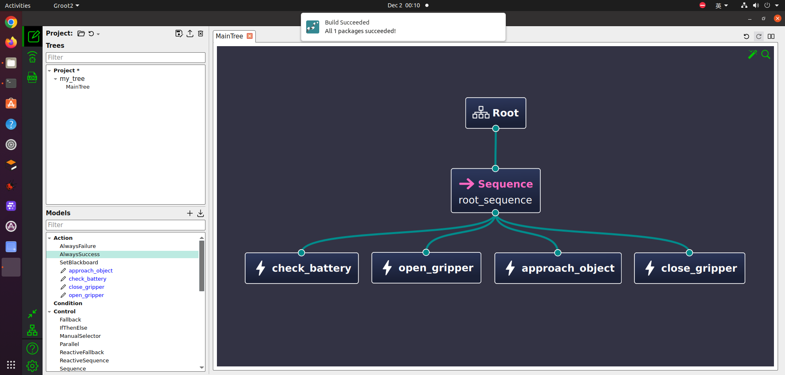

# 安装behaviortree
```bash
cd ~
git clone https://github.com/BehaviorTree/BehaviorTree.CPP.git
cd BehaviorTree.CPP
mkdir build
cd build
cmake ..
make
sudo make install
```

# 安装behaviortree | 安装行为树
```bash
sudo apt install ros-noetic-apriltag-ros ros-noetic-apriltag -y
sudo apt install ros-noetic-behaviortree-cpp-v3
```

# 安装Groot2 | 编辑行为树
```bash
wget https://s3.us-west-1.amazonaws.com/download.behaviortree.dev/groot2_linux_installer/Groot2-v1.6.1-linux-installer.run
sudo chmod +x Groot2-v1.6.1-linux-installer.run
./Groot2-v1.6.1-linux-installer.run
```

# 效果Groot2 
* 